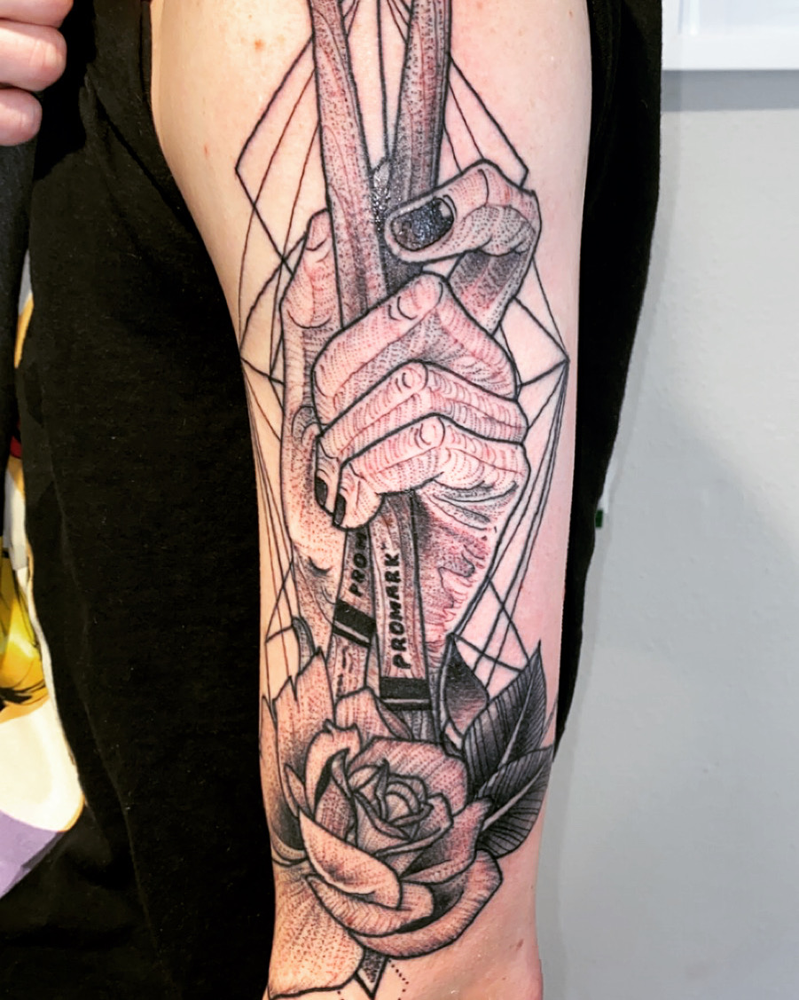

# My Tattoo 3/5/20

## Experience
I decided to get a large arm piece done back in October. Getting this tattoo was a big step up in body art for me. In the past, I have only ever gotten one small tattoo that took maybe an hour. Going into this piece my mindset was all over the place. "How long will this take?", "How badly will this hurt over time?", "Stop acting like such a baby", were some of the more pressing thoughts. In reality I was scaring myself way too much, the entire process only took 3 1/2 hours. After the first 20 minutes the pain was completely in the background of my mind, and I was just sitting there for the ride. 
## Healing
It's been about 10 days since I got this done, and let me tell you I have _never_ wanted to scratch the living hell out of my arm so badly. I'll be sitting at home completely fine when all of a sudden, it feels like 20 mosquitos are biting my arm at the same time. My skin is starting to peel & scab up. I cannot wait for this thing to be full healed.
#### [Click Here](https://authoritytattoo.com/tattoo-aftercare/) to see what tattoo aftercare regimen i'm using!